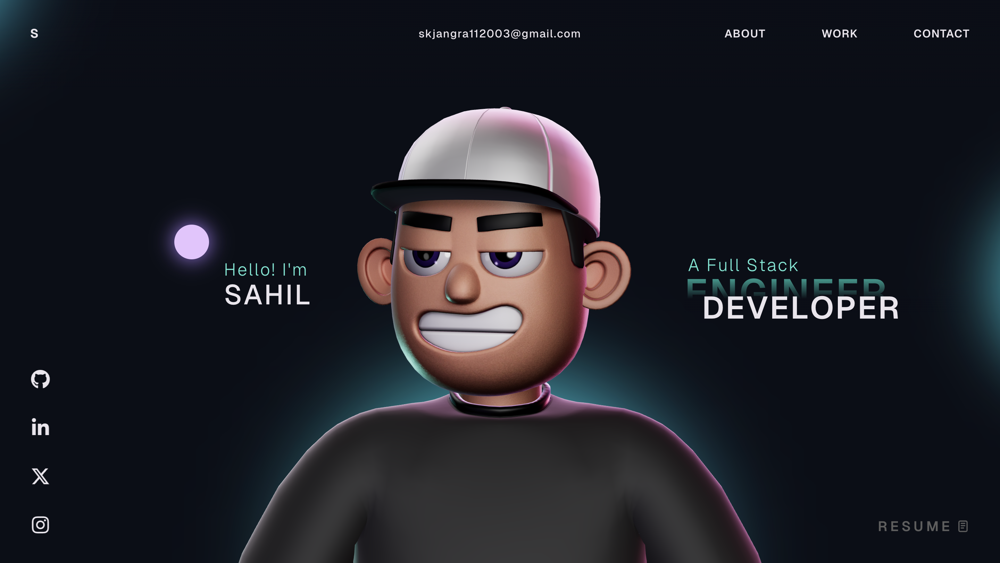
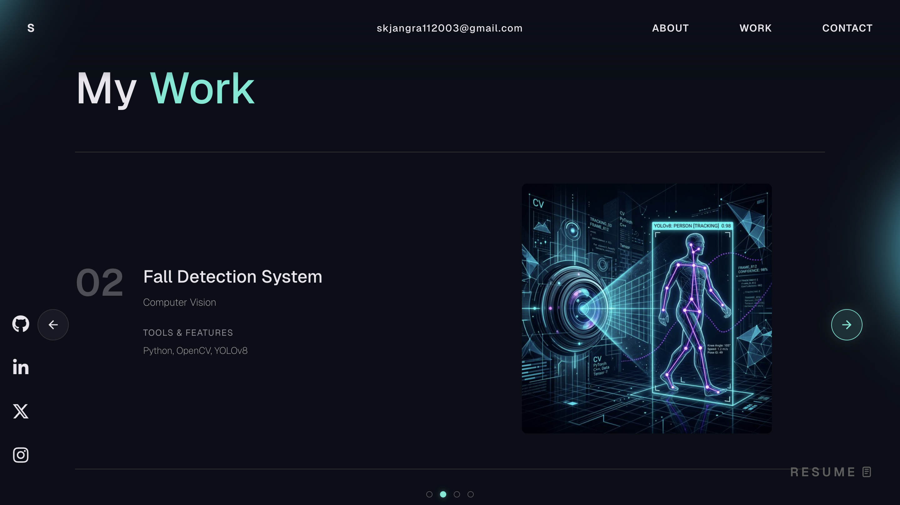
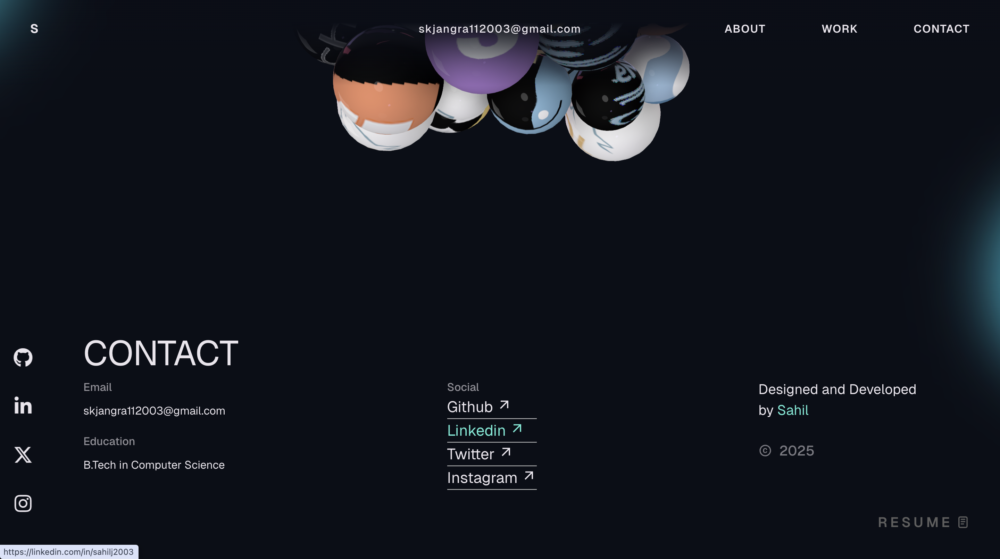

# 🌐 Personal Portfolio Website

Hi, I'm Sahil 👋
This is my personal portfolio website where I showcase my projects, skills, and journey as a Front-End Developer.
(what I love the most is wherever I move the cursor eyes follows the cursor and reflection of computer and responsive desin WORK IN PHONE TOO)

---

## 🚀 Live Demo

🔗 https://sahilportfolio30001.netlify.app/

---

## 🎥 Demo Video

[](https://www.youtube.com/watch?v=-1dsO3Gwkpg)

---

## 📸 Screenshots

### 🏠 Home Page



### 💼 Projects Section



### 📬 Contact Section



---

## 🛠️ Tech Stack

* HTML5
* CSS3
* JavaScript
* React
* UI/UX

---

## ✨ Features

* Responsive design (mobile + desktop) (Ys work in phone too)
* Clean UI/UX
* Smooth animations
* Projects showcase
* Contact section

---

## 📂 Folder Structure

```
portfolio/
│── index.html
│── style.css
│── script.js
│── assets/
│   └── images/
```

---

## 🧠 What I Learned

* Responsive web design
* UI/UX improvement
* Writing clean and structured code

---

## 📬 Contact

* GitHub: https://github.com/Sahilj2003
  

---

## ⭐ Motivation

I built this project to strengthen my front-end development skills and prepare for internship opportunities like TakeUForward.

---

> ⭐ If you like this project, feel free to star it!

